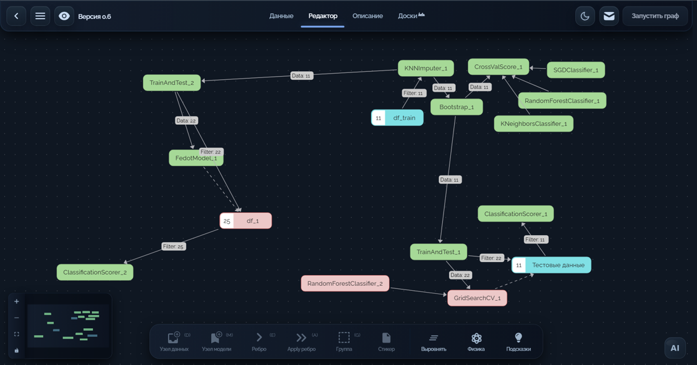
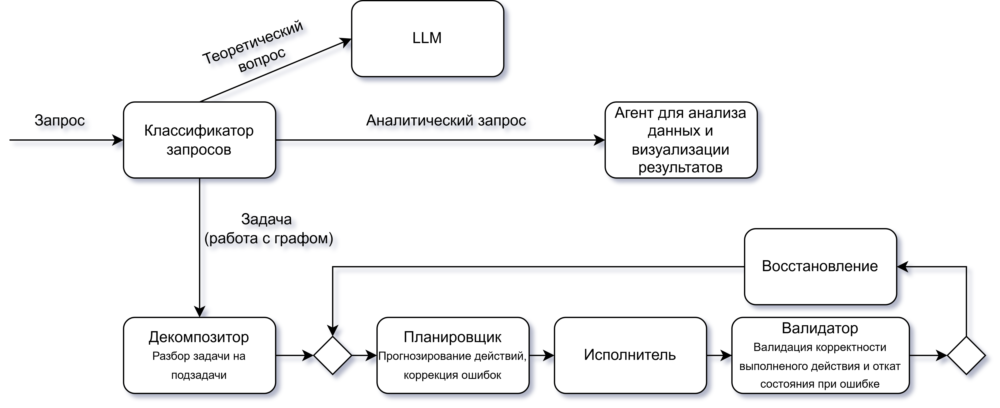
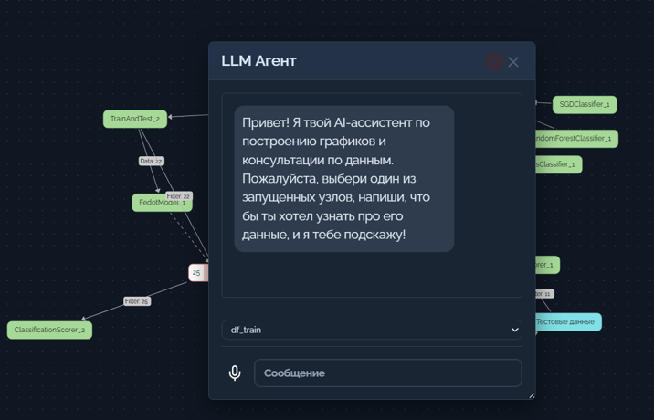
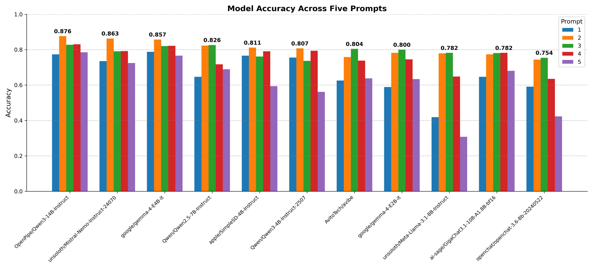
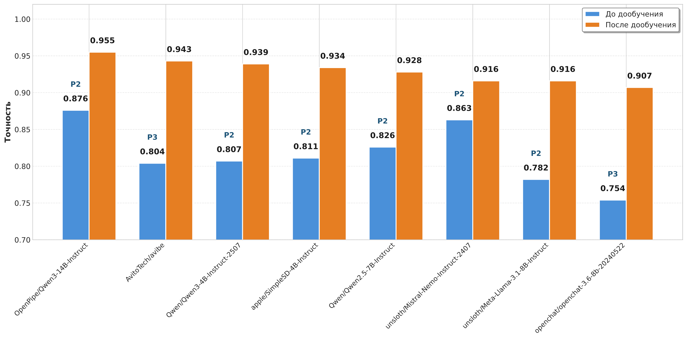
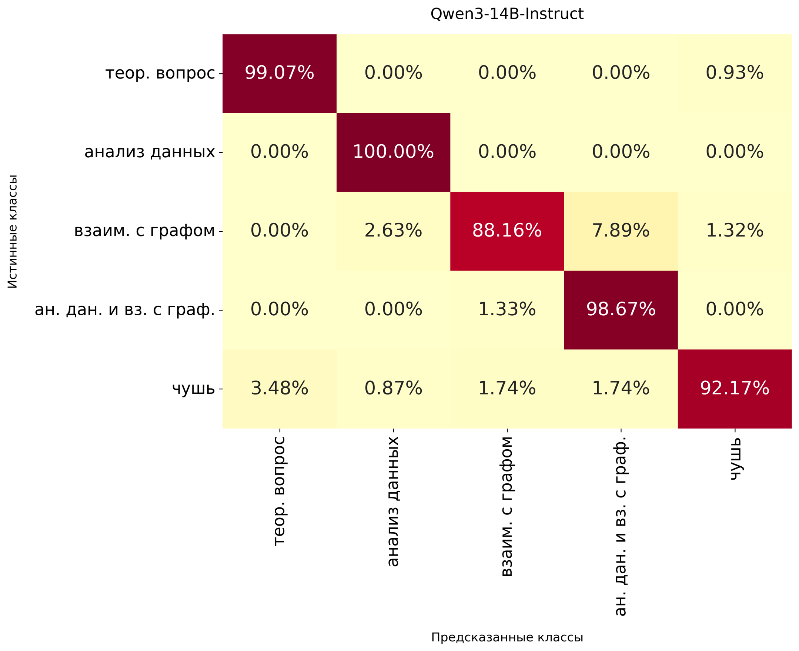
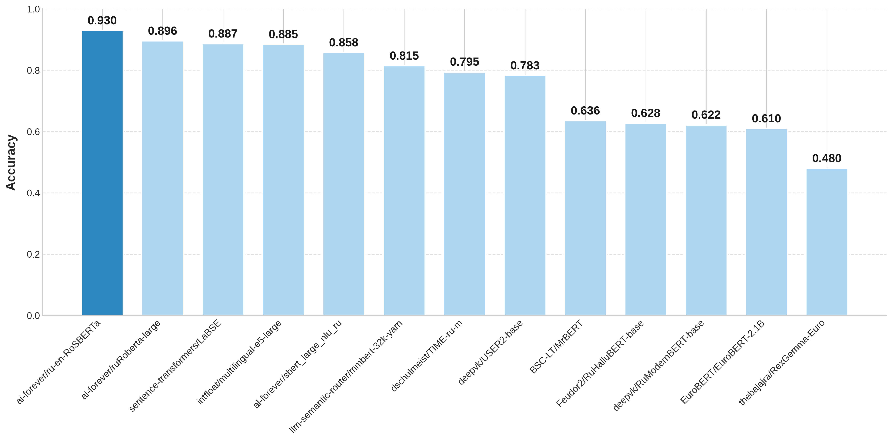
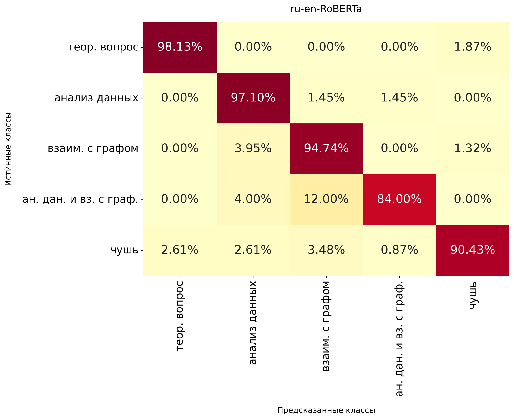
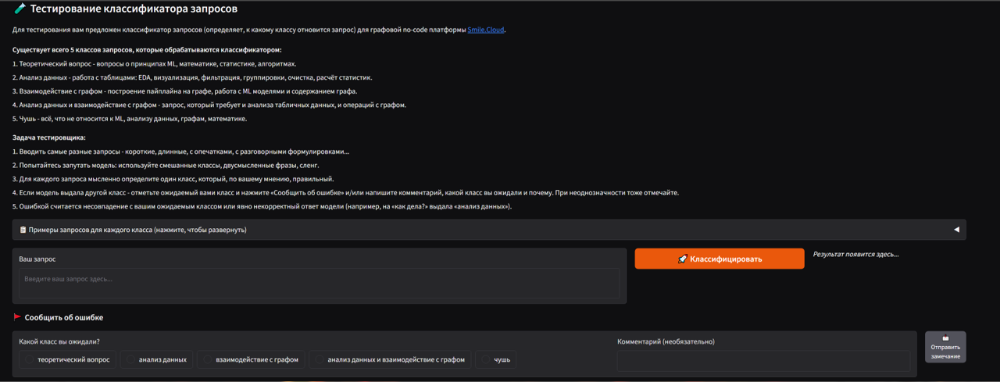

# Разработка алгоритма классификации запросов пользователя в свободной форме для AI агента для No-Code платформы SMILE

## 0. Предисловие
Данная НИР является продолжением работы 1го семестра. Подробнее [здесь](https://github.com/VladislavEvdokimov/Research_project_1sem_Evdokimov_V.B/tree/main)


## 1. SMILE.CLOUD
SMILE.CLOUD — это облачная платформа, позволяющая людям без знания языков программирования заниматься начиная анализа данных заканчивая обучением моделей за счёт использования графовой структуры вместо кода для построения пайплайна.

<p align="center">

</p>

Планом следующей ступени автоматизации пользовательского опыта является интеграция системы для взаимодействия с пайплайном с помощью текстовых запросов, а поскольку запросы могут быть различных типов (подробнее на схеме) и выполнять их будут различные по назначению агенты, то необходим классификатор запросов, который бы корректно определял тип запроса и отправлял бы его соответствующему агенту.

<p align="center">

</p>

## 2. Проблематика
В нынешнее время уровень возможной автоматизации и её доступность вышли на новый уровень, предлагая ранее невиданные ранее возможности даже самому делёкому от этого человеку. 
Имплементация агента для работы с машинным обучением снизит порог вхождения для потенциально заинтересованных в этом людей.

На данный момент на платформе реализован более простой AI агент, способный лишь давать информацию об отдельных узлах графа.
<p align="center">

</p>

## 3. Цель и задачи

3.1 **Цель исследования: Разработать алгоритм классификации запросов пользователя в свободной форме**  
  

3.2 **Задачи:**  
   - Увеличить количество потенциальных запросов пользователей для обучения моделей;
   - Исследовать и найти наиболее подходящие инструменты для инференса и обучения моделей, а также фреймворки для создания интерфейса взаимодействия с моделью;
   - Найти модели с наилучшей точностью классификации, подобрать промпт в случае в моделям на архитектуре transformer;
   - Дообучить модели для достижения наилучшей точности классификации;
   - Оценить получившиеся модели после дообучения на тестировочных данных и выбрать наилучшую;
   - Создать интерфейс для взаимодействия с моделью для проведения внешнего тестирования;
   - Провести внешнее тестирование с целью оценки качества классификационной способности обученной модели.
   


## 4. Методология

### 4.1 Сбор и подготовка данных:
- Выделены 5 классов возможных пользовательских запросов: 1. теоретический вопрос, 2. анализ данных, 3. взаимодействие с графом, 4. анализ данных и взаимодействие с графом, 5. чушь.
- Увеличение обучающий датасет до 1600 экземпляров и тестировочный до 600 экземпляров.

### 4.2 Исследуемые подходы:
4.2.1. **LLM с промпт-инжинирингом**

Было разработано 5 различных по сложности формулировок и длине промптов. Подробнее с ними можно ознакомиться [здесь](https://github.com/VladislavEvdokimov/Research_project_2sem_Evdokimov_V.B/blob/main/prompts.txt).

4.2.2. **Fine-tuning LLM моделей LoRa методом**
   - Выбранные модели:
   
    "apple/SimpleSD-4B-instruct",
    "Qwen/Qwen3-4B-Instruct-2507",
    "Qwen/Qwen2.5-7B-Instruct",
    "unsloth/Meta-Llama-3.1-8B-Instruct",
    "openchat/openchat-3.6-8b-20240522",
    "AvitoTech/avibe",
    "OpenPipe/Qwen3-14B-Instruct",
    "unsloth/Mistral-Nemo-Instruct-2407",
	
4.2.3. **Fine-tuning Bert моделей LoRa методом**
   - Выбранные модели:
     
    "ai-forever/ruRoberta-large",
    "sentence-transformers/LaBSE",
    "ai-forever/sbert_large_nlu_ru",
    "codefuse-ai/F2LLM-v2-1.7B-Preview",
    "dschulmeist/TiME-ru-m",
    "ai-forever/ru-en-RoSBERTa",
    "microsoft/harrier-oss-v1-0.6b",
    "EuroBERT/EuroBERT-2.1B",
    "deepvk/RuModernBERT-base",
    "thebajajra/RexGemma-Euro",
    "BSC-LT/MrBERT",
    'Feudor2/RuHalluBERT-base',
    'deepvk/USER2-base',
    'llm-semantic-router/mmbert-32k-yarn',
    'intfloat/multilingual-e5-large'.
	
### 4.3 Технологическая составляющая:

   - Метрика оценки качества: F1-score
   - TaskType: `SEQ_CLS`.
   - Обучение на датасете до 1600 экземпляров, тестирование и валидация в соотношении 65% и 35% на тестировочном датасете с использованием стратификации.
   - Обучение LLM проходило со следующими параметрами:
```python
r=8,
lora_alpha=16,
lora_dropout=0.035,
learning_rate=2e-5,
bf16=True,
load_best_model_at_end=True,
```
   - Обучение Bert проходило со следующими параметрами:

```python
LORA_R = 16,
LORA_ALPHA = 32,
LORA_DROPOUT = 0.05,
LEARNING_RATE = 2e-4,
bf16=True,
load_best_model_at_end=True,
```


### 4.3 Среднее время ответа:

| Модель | Среднее (сек) | Медиана (сек) | Минимум (сек) | Максимум (сек) | Стандартное отклонение |
|--------|---------------|---------------|---------------|----------------|------------------------|
| **BERT**  | 0.126        | 0.095        | 0.069        | 0.423         | 0.100                 |
| **LLM** | 0.446        | 0.405        | 0.291        | 0.807         | 0.138                 |


## 5. Ход исследования

### 5.1 LLM с промпт-инжинирингом
Наивысшая точность локальной LLM Qwen3-14B на тестовом датасете без дообучения ~88%.

<p align="center">

</p>

### 5.2 Дообучение LLM 
Наивысшая точность локальной LLM Qwen3-14B на тестовом датасете уже после дообучения ~95%.

<p align="center">

</p>

### 5.3 Матрица ошибок наилучшей LLM модели

Лучше всего предсказывается класс «Анализ данных» - 100% точности, хуже – «взаимодействие с графом» - 88%.

<p align="center">

</p>

### 5.4 Результаты fine-tuning BERT
Наивысшая точность BERT модели на тестовом датасете ~93% после дообучения.

<p align="center">

</p>


### 5.5 Матрица ошибок наилучшей BERT модели

Лучше всего предсказывается класс «Теоретический вопрос» - 98% точности, хуже – «анализ данных и взаимодействие с графом» - 84%.

<p align="center">

</p>


### 5.6 app.smilecloudclassifier.ru 

Был сделан сайт для легкого доступа для тестирования полученных моделей. Одновременно тестируются модель Qwen 3-4B и ru-en-RoSBERTa, но выводится ответ LLM. Все запросы и результаты классификации обоих моделей сохраняются на сервере. 

<p align="center">

</p>

### 5.7 BERT vs LLM: анализ результатов внешенго тестирования 

| Модель | Лучше всего | Проблема |
|--------|-------------|----------|
| **LLM** | Сложные и смешанные запросы, анализ данных | Может путать продуктовый граф с теорией |
| **BERT** | Термины (узел, pipeline) и прямое взаимодействие с графом | Хуже распознаёт смешанные и короткие разговорные запросы |

## 6. Текущие результаты

Получена готовая для внедрения в платформу модель с высокой скоростью инференса и точностью предсказания класса запроса ~ 90%.


## 7. Ожидаемые результаты
1. Интеграция классификатора в платформу.
2. Проведение тестирования в реальных условиях работы при взаимодействии с остальными агентами.

