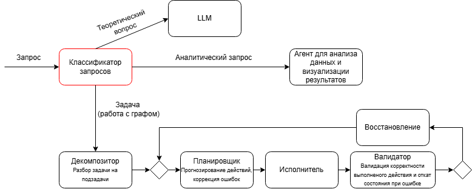
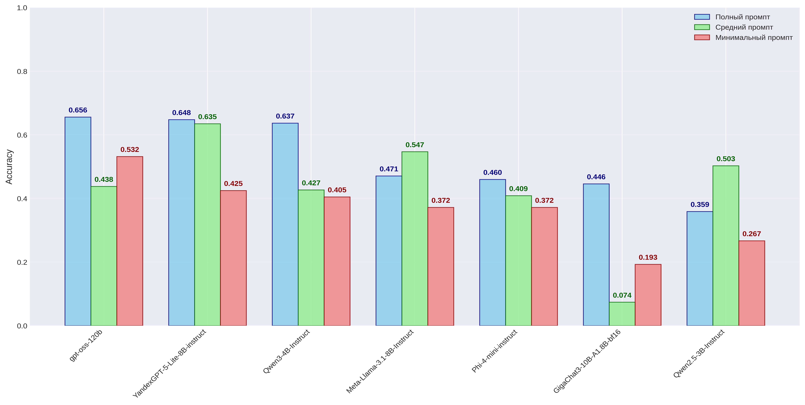
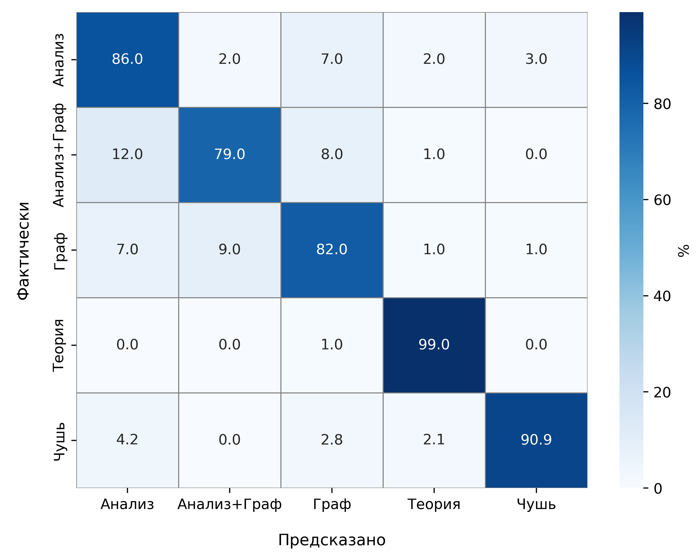
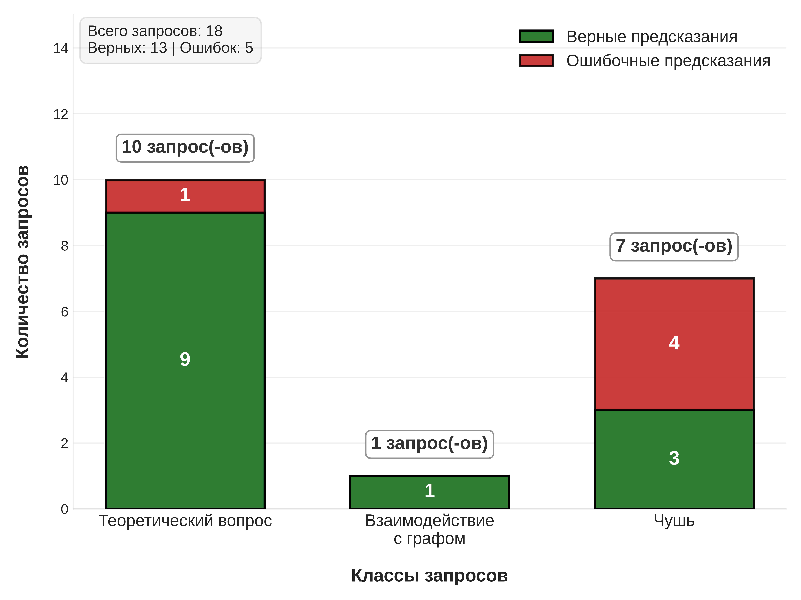

# Разработка алгоритма классификации запросов пользователя в свободной форме для AI агента для No-Code платформы SMILE

## 0. Предислование
Данная НИР является продолжением работы 1го семестра. Подробнее [здесь](https://github.com/VladislavEvdokimov/Research_project_1sem_Evdokimov_V.B/tree/main)


## 1. SMILE.CLOUD
SMILE.CLOUD — это облачная платформа, позволяющая людям без знания языков программирования заниматься начиная анализа данных заканчивая обучением моделей за счёт использования графовой структуры вместо кода для построения пайплайна.

<p align="center">

</p>

Планом следующей ступени автоматизации пользовательского опыта является интеграция системы для взаимодействия с пайплайном с помощью текстовых запросов, а поскольку запросы могут быть различных типов (подробнее на схеме) и выполнять их будут различные по назначению агенты, то необходим классификатор запросов, который бы корректно определял тип запроса и отправлял бы его соответствующему агенту.

<p align="center">

</p>

## 2. Проблематика
Необходимость классификатора запросов пользователя. 

<p align="center">

</p>

## 3. Цель и задачи

3.1 **Цель исследования: Разработать алгоритм классификации запросов пользователя в 
свободной форме**  
  

3.2 **Задачи:**  
   - Увеличить количество потенциальных запросов пользователей для обучения моделей;
   - Исследовать и найти наиболее подходящие инструменты для инференса и обучения моделей, а также фреймворки для создания интерфейса взаимодействия с моделью;
   - Найти модели с наилучшей точностью классификации, подобрать промпт в случае в моделям на архитектуре transformer;
   - Дообучить модели для достижения наилучшей точности классификации;
   - Оценить получившиеся модели после дообучения на тестировочных данных и выбрать наилучшую;
   - Создать интерфейс для взаимодействия с моделью для проведения внешнего тестирования;
   - Провести внешнее тестирование с целью оценки качества классификационной способности обученной модели.
   

### Многоагентная система обработки текстовых запросов

## 4. Методология

### 4.1 Сбор и подготовка данных:
- Выделены 5 классов возможных пользовательских запросов: 1. теоретический вопрос, 2. анализ данных, 3. взаимодействие с графом, 4. анализ данных и взаимодействие с графом, 5. чушь.
- Увеличение обучающий датасет до 1600 экземпляров и тестировочный до 600 экземпляров.

### 4.2 Исследуемые подходы:
4.2.1. **LLM с промпт-инжинирингом**
4.2.2. **Fine-tuning LLM моделей LoRa методом**
   - Выбранные модели:
    "apple/SimpleSD-4B-instruct",
    "Qwen/Qwen3-4B-Instruct-2507",
    "Qwen/Qwen2.5-7B-Instruct",
    "unsloth/Meta-Llama-3.1-8B-Instruct",
    "openchat/openchat-3.6-8b-20240522",
    "google/gemma-4-E2B-it",
    "google/gemma-4-E4B-it",
    "AvitoTech/avibe",
    "OpenPipe/Qwen3-14B-Instruct",
    "unsloth/Mistral-Nemo-Instruct-2407",
    'ai-sage/GigaChat3.1-10B-A1.8B-bf16',
    "yandex/YandexGPT-5-Lite-8B-instruct",
	
4.2.3. **Fine-tuning Bert моделей LoRa методом**
   - Выбранные модели:     
    "ai-forever/ruRoberta-large",
    "sentence-transformers/LaBSE",
    "ai-forever/sbert_large_nlu_ru",
    "codefuse-ai/F2LLM-v2-1.7B-Preview",
    "dschulmeist/TiME-ru-m",
    "ai-forever/ru-en-RoSBERTa",
    "microsoft/harrier-oss-v1-0.6b",
    "EuroBERT/EuroBERT-2.1B",
    "deepvk/RuModernBERT-base",
    "thebajajra/RexGemma-Euro",
    "BSC-LT/MrBERT",
    'Feudor2/RuHalluBERT-base',
    'deepvk/USER2-base',
    'llm-semantic-router/mmbert-32k-yarn',
    'intfloat/multilingual-e5-large'.
	
### 4.3 Технологическая составляющая:

   - Метрика оценки качества: F1-score
   - TaskType: SEQ_CLS.
   - Обучение на датасете до 1600 экземпляров, тестирование и валидация в соотношении 65%:35% на тестировочном датасете с использованием стратификации.
   - Обучение LLM проходило со следующими параметрами:
		```r=8,
        lora_alpha=16,
        lora_dropout=0.035,
		learning_rate=2e-5,
		bf16=True,
		load_best_model_at_end=True,
		```
	- Обучение Bert проходило со следующими параметрами:
		```LORA_R = 16,
			LORA_ALPHA = 32,
			LORA_DROPOUT = 0.05,
			LEARNING_RATE = 2e-4,
			bf16=True,
			load_best_model_at_end=True,
		```


## 5. Ход исследования

### 5.1 Сравнение LLM подходов
Наивысшая точность локальной LLM модели YandexGPT-5-Lite-8B-instruct на тестовом датасете составляет ~65% с длинным промптом, как и у API LLM модели gpt-oss-120b.

<p align="center">

</p>

### 5.2 Результаты fine-tuning BERT
Наивысшая точность BERT модели LaBSE на тестовом датасете ~88%.

<p align="center">

</p>

### 5.3 Матрица ошибок наилучшей BERT модели

Лучше всего предсказывается класс «Теоретический вопрос» - 99% точности, хуже – «анализ данных и взаимодействие с графом» - 79%.

<p align="center">

</p>

### 5.4 Внешнее тестирование наилучшей BERT модели 

Внешнее тестирование показало, что точность модели может быть ещё улучшена 

<p align="center">

</p>

## 6. Текущие результаты

1. Получена готовая для внедрения в платформу модель с высокой скоростью инференса и accuracy предсказания класса запроса ~ 88%.
2. Создан датасет, являющийся отправной точкой для дальнейшего улучшения модели.

## 7. Ожидаемые результаты
1. Дальнейшее привлечение третьих лиц для оценки и тестирование классификатора.
2. Расширение датасета новыми вариантами запросов.
3. Попытка улучшить точность при помощи LLM.
4. Интеграция алгоритма в платформу

